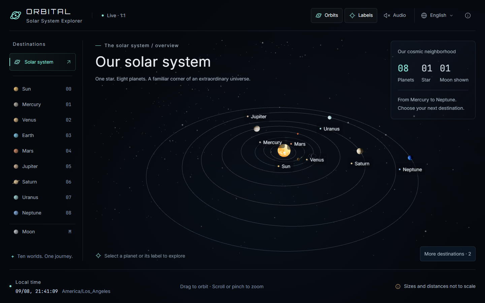
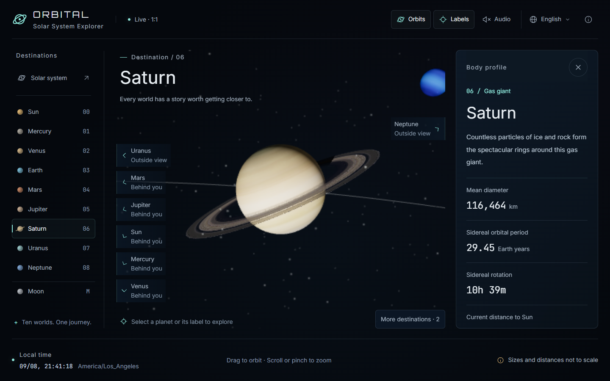
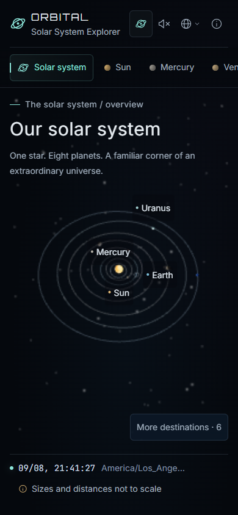

# ORBITAL · Solar System Explorer

A quiet window into our solar system. Explore the Sun, all eight planets, and the Moon in 3D, at the pace of the real world.

**[Open the online demo](https://3d-earth-simulator.netlify.app/)** · English | [简体中文](./README.zh-CN.md)



## Your next destination

Start with the whole solar system, then get closer to any world. Follow Earth's day and night, discover Saturn's rings, or find Neptune on the edge of your view.

- **Real time, 1:1.** Positions and rotation follow your device's clock. Nothing speeds up when you open the page.
- **Ten destinations.** The Sun, Mercury, Venus, Earth, Mars, Jupiter, Saturn, Uranus, Neptune, and our Moon.
- **A profile for every world.** Read a short introduction, diameter, orbital period, rotation period, and current distance, with links to the data sources.
- **A way to find your bearings.** Edge arrows point toward worlds outside your view. Crowded or hidden destinations remain available in the navigation and “More destinations” menu.
- **Your language and local time.** English and Simplified Chinese are included. The language menu supports additional language packs and a “Follow system” setting.
- **An optional soundtrack.** Turn on the space ambient track, adjust the volume, or enjoy the silence. Music starts only when you ask it to.

## Explore in a few clicks

| To… | Do this |
| --- | --- |
| Visit a world | Select its name in the navigation, click the planet itself, or click its label |
| Look around | Drag the scene; use the wheel or pinch to zoom |
| Find another planet | Select an edge arrow or open “More destinations” |
| Return to the full system | Select **Solar system** |
| Close a profile | Select **×** or press **Esc**; your viewpoint stays in place |
| Change the language | Open the globe menu and choose a language or **Follow system** |
| Play or mute music | Open **Audio** and use the play/mute button |
| Adjust volume with a keyboard | Focus the volume slider and use the arrow keys; Home/End select 0%/100% |

On a phone, swipe the destination bar to find more planets. Profiles slide in from the right and scroll independently.

| Earth's night side | Saturn and its profile |
| --- | --- |
|  |  |

<details>
<summary>See the mobile layout</summary>



</details>

## Time, scale, and what you see

The same instant produces the same planetary positions everywhere on Earth. Your time zone changes the clock display and the initial Earth viewpoint; it does not move the planets. Earth opens toward a representative location for your time zone, rather than a precise GPS location. Its profile also shows approximate local sunrise, sunset, and the illuminated fraction of the Moon.

**Sizes and distances are scaled separately** so that inner and outer planets can share the screen. Orbit guides follow sampled astronomical positions. Profile distances come from the unscaled coordinates, not from the displayed spacing.

Planet diameters use volume-equivalent mean values. Rotation periods are measured relative to the stars: Earth's is about **23 hours 56 minutes**. Venus and Uranus are marked as retrograde. Giant-planet rotation uses JPL reference values; the Sun's equatorial rotation is shown as an approximation. The Moon's 27.3-day orbit is distinct from its roughly 29.5-day phase cycle.

Astronomical calculations use [Astronomy Engine](https://github.com/cosinekitty/astronomy). Tests compare the eight planets and the Moon against 27 [JPL Horizons](https://ssd.jpl.nasa.gov/horizons/) samples from 2000, 2026, and 2040; the largest angular difference in those samples is about 15 arcseconds. Surface textures and the decorative star field are not live imagery or an observing star chart.

## Small details, considered

The interface uses text of at least 14px, visible keyboard focus, styled language and audio controls, and reduced-motion preferences. On slower devices, the scene can lower its rendering resolution while interface text stays sharp. It remembers your language choice and volume. Each new visit starts quietly; background tabs pause rendering and music, and returning synchronizes the scene to the current time.

A modern browser with **WebGL 2** is required. If the scene cannot start, enable hardware acceleration or try another browser. A failed surface texture does not stop you from navigating the system. All visual assets, fonts, music, and calculations are served with the app; no account, GPS permission, or geolocation service is required.

<details>
<summary>Run it on your computer</summary>

Use Node.js 22 or newer and pnpm.

```bash
pnpm install --frozen-lockfile
pnpm dev
```

Open the local address printed in the terminal.

```bash
pnpm typecheck
pnpm test
pnpm test:e2e
pnpm build
pnpm preview
```

The browser tests require Playwright Chromium (`pnpm exec playwright install chromium`). The production output in `dist/` can be hosted as a static site, including under a subdirectory.

</details>

## Credits and license

Code: [MIT](./LICENSE). Third-party assets keep their own licenses.

- [Three.js](https://threejs.org/) and [Astronomy Engine](https://github.com/cosinekitty/astronomy) — rendering and astronomy, MIT.
- [NASA / JPL](https://ssd.jpl.nasa.gov/planets/phys_par.html) — physical and orbital reference data.
- [Solar System Scope](https://www.solarsystemscope.com/textures/) — surface and ring textures, CC BY 4.0, converted to WebP where applicable.
- [Galactic Temple by yd](https://opengameart.org/content/galactic-temple) — ambient music, CC0.
- Inter, JetBrains Mono, and Orbitron — fonts, SIL Open Font License.

See [Third-party notices](./NOTICES.md) for asset details, changes, and license texts.
