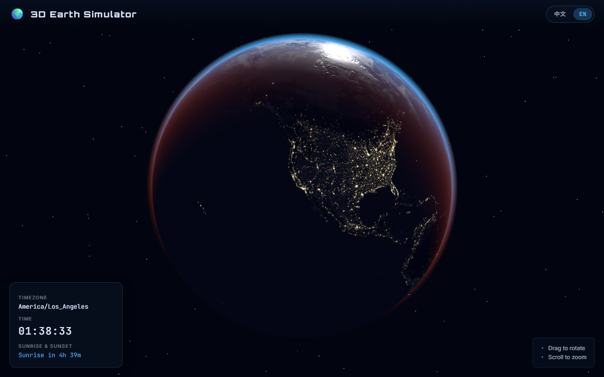

# 3D Earth Simulator

> A real-time 3D Earth with day/night cycle and auto-located visitor view — pure frontend, no backend.


[Online Demo](https://3d-earth-simulator.netlify.app/)

English | [中文](./README.zh-CN.md)

## Overview

3D Earth Simulator is a single-page web application that renders a real-time 3D Earth in your browser. It uses Three.js to draw a textured Earth sphere, computes the sun's position from the current UTC time to draw an accurate day/night terminator, and auto-rotates the view to face your current location.

The entire experience is self-contained: no backend, no API keys (except a public IP geolocation API for first-load location detection), no build server at runtime.

## Screenshots

The initial view auto-locates the visitor and centers the camera on their home location.

The terminator (day/night line) is computed from the current UTC sun position.



The page starts with a fast rotation (600× real-time) so you can immediately see the planet is alive.

After locating you, the camera tweens to your home position over 3 seconds while easing the spin back to 1×.

Drag to rotate manually; a "Reset view" button appears so you can fly back home.

## Features

- **Real-time day/night cycle** — sun position computed from current UTC time, terminator updates every frame
- **1:1 Earth rotation** — Earth rotates at real-world speed (24h/revolution)
- **Auto-located view** — initial camera position points to your actual location (IP API + `Intl` fallback)
- **Drag & zoom** — `OrbitControls` for intuitive interaction
- **Recenter button** — appears after manual rotation, click to fly back to your home view
- **City lights at night** — NASA Black Marble overlay shows real city light patterns on the night side
- **Multilingual UI** — zh-CN / en-US out of the box, custom language packs via `window.appI18n.registerLocale()`
- **Self-hosted fonts** — Orbitron / Inter / JetBrains Mono served locally as woff2, no Google Fonts CDN dependency
- **Responsive layout** — works on mobile and desktop, TailwindCSS
- **Pure frontend** — single Vite + TypeScript codebase, deployable to GitHub Pages / Vercel / Netlify with zero config

## Tech Stack

| Layer | Choice |
| --- | --- |
| Renderer | [Three.js](https://threejs.org/) r160 |
| Build | [Vite](https://vitejs.dev/) 5 + TypeScript 5 |
| Styling | [TailwindCSS](https://tailwindcss.com/) 3 |
| Controls | `three/examples/jsm/controls/OrbitControls` |
| Geolocation | `ipapi.co` / `ipwho.is` (CORS-friendly, no key) |
| Testing | [Vitest](https://vitest.dev/) |

## Quick Start

Requirements: Node.js ≥ 18, [pnpm](https://pnpm.io/) ≥ 8 (or `npm` / `yarn`).

```bash
# Install dependencies
pnpm install

# Start dev server
pnpm dev
# → http://localhost:5173

# Build for production
pnpm build

# Preview production build
pnpm preview

# Run tests
pnpm test
```

## Project Structure

```dir
3d-earth-simulator/
├── public/                 # Static assets (textures, fonts)
├── src/
│   ├── main.ts             # Entry point
│   ├── app.ts              # App initialization
│   ├── scene/              # Three.js scene modules
│   ├── shaders/            # GLSL shaders (earth day/night, atmosphere)
│   ├── geo/                # Geolocation logic
│   ├── i18n/               # Multilingual system
│   ├── ui/                 # UI components (top bar, info card, etc.)
│   ├── utils/              # Sun / time utilities
│   ├── styles/             # TailwindCSS + global styles
│   └── types/              # TypeScript type declarations
├── tests/                  # Vitest unit tests
├── index.html              # Vite entry
├── vite.config.ts
├── tailwind.config.js
├── tsconfig.json
├── package.json
├── LICENSE
└── NOTICES.md
```

## Browser Support

- Chrome / Edge ≥ 100
- Firefox ≥ 100
- Safari ≥ 15
- Mobile Safari / Chrome Android (responsive layout)

Requires WebGL 2 support. No WebGL 1 fallback.

## Customization

### Change language at runtime

Open the browser console:

```js
window.appI18n.registerLocale('ja-JP', {
  'tz.label': 'タイムゾーン',
  'time.label': '現在時刻',
  // ...
});
window.appI18n.setLocale('ja-JP');
```

## License

[MIT](./LICENSE) — free for personal and commercial use.

## Acknowledgments

- [Three.js](https://threejs.org/) — the rendering engine
- [NASA Visible Earth](https://visibleearth.nasa.gov/) — Blue Marble and Black Marble textures (public domain)
- [Google Fonts](https://fonts.google.com/) — Orbitron, Inter, JetBrains Mono (OFL)

See [NOTICES.md](./NOTICES.md) for the full third-party license list.
