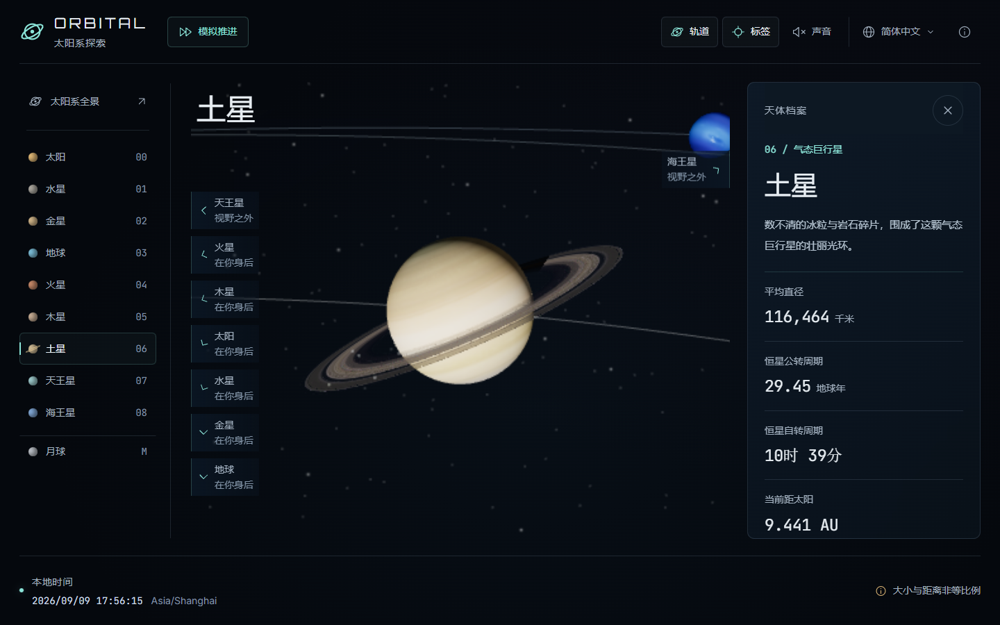
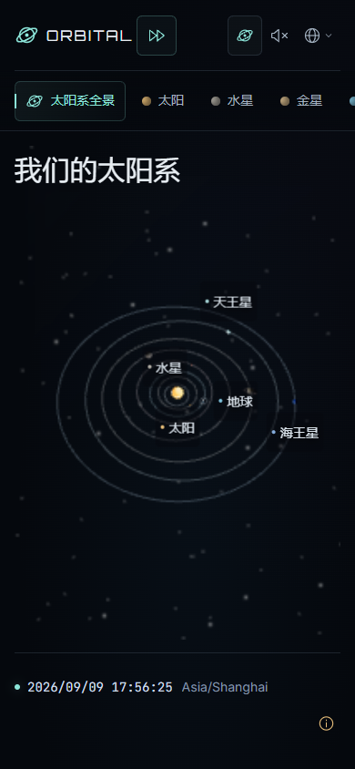

# ORBITAL · 太阳系探索

打开一扇通往太阳系的窗。以现实世界的节奏，在三维空间中探索太阳、八大行星和月球。

**[打开在线体验](https://3d-earth-simulator.netlify.app/)** · [English](./README.md) | 简体中文


## 选择你的下一站

从整个太阳系出发，靠近每一个世界。观察地球的昼夜交替，欣赏土星的光环，或循着视野边缘的方向找到海王星。

- **实时或模拟推进。** 默认按现实时间 1:1 运行；也可每秒推进 30 天，并一键恢复当前时刻。
- **十个探索目的地。** 太阳、水星、金星、地球、火星、木星、土星、天王星、海王星，以及月球。
- **每个世界都有档案。** 一句话简介、直径、公转周期、自转周期、当前距离，并附数据来源。
- **随时找到方向。** 边缘箭头指向视野之外的天体；所有天体均可通过导航访问。
- **你的语言与当地时间。** 内置中文和英文；语言菜单支持扩展语言包，也可选择“跟随系统”。
- **可选的太空配乐。** 主动开启环境音乐，调节音量，或保持安静。页面不会自动播放声音。

## 几步开始探索

| 想要做什么 | 操作方式 |
| --- | --- |
| 前往一个世界 | 点击导航中的名称、星球本体或场景标签 |
| 调整观察角度 | 拖动场景旋转；滚轮或双指缩放 |
| 寻找其他行星 | 点击屏幕边缘的箭头，或使用天体导航 |
| 加快时间 | 点击左上角 **模拟推进**，日期与公转每秒前进约一个月（30 天） |
| 显示或隐藏轨道 | 使用右上角 **轨道** 开关；切换天体不会更改显示状态 |
| 恢复当前时间 | 点击 **恢复实时** |
| 回到完整太阳系 | 点击 **太阳系全景** |
| 关闭档案 | 点击 **×** 或按 **Esc**，当前观察视角会保留 |
| 切换语言 | 打开地球图标菜单，选择语言或 **跟随系统** |
| 播放或静音 | 打开 **声音** 面板，点击播放或静音 |
| 用键盘调节音量 | 聚焦音量条后使用方向键；Home/End 分别设为 0%/100% |

手机上可左右滑动目的地导航。资料卡从右侧滑入，内容可独立滚动。

| 地球与所在地视角 | 土星与资料卡 |
| --- | --- |
|  |  |

<details>
<summary>查看手机版布局</summary>



</details>

## 时间、比例与画面

本地时钟包含年份，始终显示真实时间。开启模拟推进后会另行显示模拟日期，公转、月相和距离跟随模拟时刻变化。表面自转采用连续、较慢的示意动画，避免大陆闪跳或看似倒转；点击“恢复实时”后会平滑对齐真实姿态，并回到当前时刻。

同一时刻，世界各地访问者看到的天体位置相同。时区只影响时间显示和地球的初始观察方向，不会改变行星轨道。地球视角采用所在时区的代表地点，并非精确 GPS 定位；资料卡还会显示该观察点附近的日出、日落时间和月面照明比例。

**天体大小与轨道距离分别缩放**，让内外行星可以清晰地出现在同一画面中。轨道线根据天文位置采样生成。资料卡里的实际距离取自未经缩放的坐标，不是画面中的视觉间距。

行星直径采用体积等效平均值。自转周期相对恒星测量，因此地球约为 **23 小时 56 分钟**；金星和天王星标注为逆行。巨行星采用 JPL 自转参考值，太阳则展示赤道自转约值。月球约 27.3 天绕地球一周，与约 29.5 天的月相循环有所不同。

天文计算使用 [Astronomy Engine](https://github.com/cosinekitty/astronomy)。自动测试将八大行星和月球与 2000、2026、2040 年的 27 个 [JPL Horizons](https://ssd.jpl.nasa.gov/horizons/) 样本进行对照，这些样本中的最大方向偏差约为 15 角秒。表面纹理和装饰性星空不代表实时影像或观测星图。

## 一些使用细节

全站文字不低于 14px，支持可见的键盘焦点、定制语言与声音控件，以及系统减少动态效果的偏好。较慢的设备会自动降低三维画面分辨率，界面文字保持清晰。页面会记住手动语言选择和音量；每次新访问默认安静。切到后台时暂停渲染与音乐，返回后同步所选时钟；模拟模式会计入离开页面期间经过的时间。

需要支持 **WebGL 2** 的现代浏览器。如果无法显示场景，可启用硬件加速或换一个浏览器。部分纹理加载失败时仍可继续探索。图片、字体、音乐和计算均随应用提供，无需注册账号、GPS 授权或调用定位服务。

<details>
<summary>在自己的电脑上运行</summary>

准备 Node.js 22 或更新版本，以及 pnpm。

```bash
pnpm install --frozen-lockfile
pnpm dev
```

打开终端显示的本地地址即可。

```bash
pnpm typecheck
pnpm test
pnpm test:e2e
pnpm build
pnpm preview
```

浏览器测试需要 Playwright Chromium，可用 `pnpm exec playwright install chromium` 安装。
生产文件输出到 `dist/`，支持静态托管和子目录部署。

</details>

## 致谢与授权

项目代码采用 [MIT 协议](./LICENSE)，第三方素材遵循各自的授权。

- [Three.js](https://threejs.org/) 与 [Astronomy Engine](https://github.com/cosinekitty/astronomy)：三维渲染与天文计算，MIT。
- [NASA / JPL](https://ssd.jpl.nasa.gov/planets/phys_par.html)：物理参数与轨道参考数据。
- [Solar System Scope](https://www.solarsystemscope.com/textures/)：天体与光环纹理，CC BY 4.0；适用文件已转为 WebP。
- [Scott Buckley 的 Adrift Among Infinite Stars](https://www.scottbuckley.com.au/library/adrift-among-infinite-stars/)：舒缓的钢琴、合成器与弦乐，CC BY 4.0。
- Inter、JetBrains Mono、Orbitron：字体，SIL Open Font License。

素材清单、修改说明和许可证全文见 [第三方授权说明](./NOTICES.md)。
