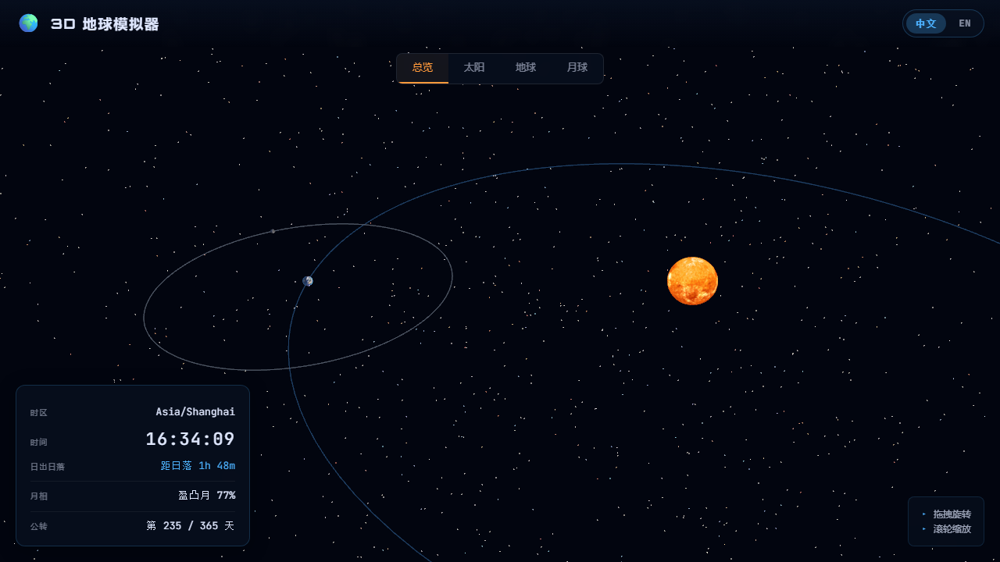
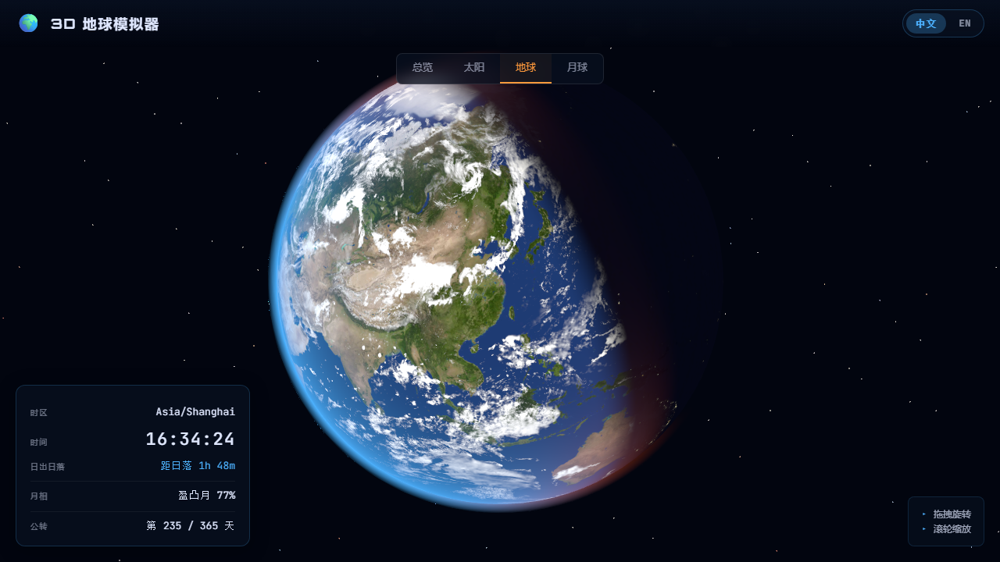

# 3D 地球模拟器

> 实时 3D 地球，支持昼夜交替、自动定位视角 — 纯前端，零后端。


[在线预览](https://3d-earth-simulator.netlify.app/)

[English](./README.md) | 中文

## 简介

3D 地球模拟器是一个单页 Web 应用，在你的浏览器里渲染一个实时 3D 地球。使用 Three.js 绘制带纹理的地球球体，根据当前 UTC 时间计算太阳位置来绘制精确的晨昏线，并自动旋转到访客所在位置。

整个体验完全自包含：无后端、无 API Key（首次定位除外，使用公共 IP 地理 API）、运行时无需构建服务器。

## 效果预览

| 总览（日地月系统） | 地球（定位视角） |
| --- | --- |
|  |  |

晨昏线由当前 UTC 太阳位置实时计算。总览视图展示日地月空间关系和双轨道线；地球视图展示定位点的真实昼夜分界，夜面叠加 NASA Black Marble 城市灯光。

页面启动时地球以 600× 真实速度高速旋转（让人一眼看到它在动）。

定位完成后，3 秒内把相机 tween 到访客位置，同时把转速平滑减速到 1×。

顶栏的 4 视图 tabs 切换 总览 / 太阳 / 地球 / 月球；拖拽旋转，滚轮缩放。

## 特性

- **实时昼夜交替** — 太阳位置由当前 UTC 时间计算，晨昏线每帧更新
- **日地月系统（SEM）** — v1.1：4 视图 tabs（总览/太阳/地球/月球），相机姿态确定性，地球视角的光照方向就是场景里的真实太阳（不再是伪造的 DirectionalLight）
- **统一天体状态** — 单一 `celestialState(instant)` 是太阳方向、地球姿态、月球位置和月相的唯一来源；场景 / 材质 / 相机 / InfoCard 都从同一状态读取
- **8 阶段月历** — moonPhase() 返回 8 阶段名 + 几何照度，InfoCard 展示
- **1:1 地球自转** — 与现实同步（24 小时 / 圈）
- **自动定位视角** — 初始镜头对正你所在位置（IP API + `Intl` 兜底）
- **拖拽 + 缩放** — `OrbitControls` 直观交互
- **夜面城市灯光** — NASA Black Marble 真实城市灯光纹理
- **多语言 UI** — 开箱即用 zh-CN / en-US，通过 `window.appI18n.registerLocale()` 支持自定义语言包
- **Dev URL 参数** — `?lan=en-US&loc=34.04,-118.25,-7&tz=America/Los_Angeles` 一键强制语言 + 定位 + IANA 时区名（截图 / 演示 / 测试用，无需 VPN）
- **本地自托管字体** — Orbitron / Inter / JetBrains Mono 以 woff2 形式本地提供，零 Google Fonts CDN 依赖
- **响应式布局** — 兼容移动端 + 桌面，使用 TailwindCSS
- **纯前端** — 单 Vite + TypeScript 代码库，可零配置部署到 GitHub Pages / Vercel / Netlify

## 技术栈

| 层级 | 选型 |
| --- | --- |
| 渲染 | [Three.js](https://threejs.org/) r160 |
| 构建 | [Vite](https://vitejs.dev/) 5 + TypeScript 5 |
| 样式 | [TailwindCSS](https://tailwindcss.com/) 3 |
| 交互 | `three/examples/jsm/controls/OrbitControls` |
| 定位 | `ipapi.co` / `ipwho.is`（CORS 友好，无需 key） |
| 测试 | [Vitest](https://vitest.dev/) |

## 快速开始

环境要求：Node.js ≥ 18，[pnpm](https://pnpm.io/) ≥ 8（或 `npm` / `yarn`）。

```bash
# 安装依赖
pnpm install

# 启动开发服务器
pnpm dev
# → http://localhost:5173

# 生产构建
pnpm build

# 预览生产产物
pnpm preview

# 运行测试
pnpm test
```

## 项目结构

```dir
3d-earth-simulator/
├── public/                 # 静态资源（纹理、字体）
├── src/
│   ├── main.ts             # 入口
│   ├── app.ts              # 应用初始化
│   ├── scene/              # Three.js 场景模块
│   ├── shaders/            # GLSL 着色器（地球昼夜、大气层）
│   ├── geo/                # 地理位置逻辑
│   ├── i18n/               # 多语言系统
│   ├── ui/                 # UI 组件（顶栏、信息卡等）
│   ├── utils/              # 太阳 / 时间工具
│   ├── styles/             # TailwindCSS + 全局样式
│   └── types/              # TypeScript 类型声明
├── tests/                  # Vitest 单元测试
├── index.html              # Vite 入口
├── vite.config.ts
├── tailwind.config.js
├── tsconfig.json
├── package.json
├── LICENSE
└── NOTICES.md
```

## 浏览器支持

- Chrome / Edge ≥ 100
- Firefox ≥ 100
- Safari ≥ 15
- Mobile Safari / Chrome Android（响应式布局）

需支持 WebGL 2。**不**提供 WebGL 1 降级。

## 自定义

### 运行时切换语言

打开浏览器控制台：

```js
window.appI18n.registerLocale('ja-JP', {
  'tz.label': 'タイムゾーン',
  'time.label': '現在時刻',
  // ...
});
window.appI18n.setLocale('ja-JP');
```

## License

[MIT](./LICENSE) — 个人和商业用途免费。

## 致谢

- [Three.js](https://threejs.org/) — 渲染引擎
- [NASA Visible Earth](https://visibleearth.nasa.gov/) — Blue Marble + Black Marble 纹理（公共领域）
- [Google Fonts](https://fonts.google.com/) — Orbitron、Inter、JetBrains Mono（OFL 协议）

完整的第三方 License 列表见 [NOTICES.md](./NOTICES.md)。
